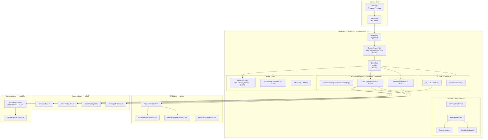

## Diagnóstico: O que Existe vs. O que o V3 Especifica

### O que já existe e NÃO deve ser reconstruído

| Módulo | Local | Status |
|--------|-------|--------|
| 35+ módulos AI (intent, context, evidence, memory, learning, predictive, decision, supervisor) | `companion/src/ai/` | ✅ Funcional |
| Workspace System (operator, findings, seo, compare, settings) | `companion/src/workspace-system/` | ✅ Funcional |
| Assistant Service (5 modos, 31 intent builders, multilingual pt/es/en/ca) | `companion/src/assistant-service.js` | ✅ Funcional |
| Predictive Intelligence, Data Intelligence, Autonomous QA, QCE, ORE, CDM | `companion/src/` | ✅ Funcional |
| Healing Engine + Strategy Registry + Impact Engine | `qa/src/healing-engine-service.mjs` etc | ✅ Existe, precisa de UI |
| Operational Memory (JSON store) | `qa/operational-memory/` | ✅ Flat, precisa evoluir |
| DataBridge (event system via MutationObserver + CustomEvents) | `workspace-system/integrations/data-bridge.js` | ✅ Funcional |
| Multilingual Adaptive Service | `companion/src/adaptive-language-service.js` | ✅ Funcional |
| IPC Preload (35 métodos expostos) | `companion/src/preload.cjs` | ✅ Funcional |

### O que está genuinamente AUSENTE

| Feature V3 | Status |
|---|---|
| TypeScript com strict mode | ❌ Tudo é JS vanilla |
| State machines formais (FSM) | ❌ Usa boolean flags |
| AI Provider abstraction (OpenAI + DeepSeek) | ❌ Sem padrão formal de adapter |
| Security Intelligence Engine (attack surface, DNA, attack paths) | ❌ Inexistente |
| Code Healing UI no companion | ❌ Engine em qa/ mas sem UI |
| AI Entity Visual (consciousness states com animações) | ❌ Sem estados formais |
| Diff viewer premium | ❌ Inexistente |
| Knowledge Graph (memória operacional em grafo) | ❌ Flat JSON |
| GitHub Connector | ❌ Inexistente |
| CommandBar (Raycast-like, Cmd+K) | ⚠️ CSS skeleton existe, incompleto |

### O que NÃO faz sentido implementar (decisão fundamentada)

| Item V3 | Razão |
|---|---|
| Migração completa para React | O renderer tem 890KB / 18.679 linhas de JS vanilla funcionando. Rewrite = risco catastrófico sem ganho operacional imediato. |
| Three.js para aura da IA | CSS 3D transforms + keyframes produzem o mesmo resultado visual. Three.js adicionaria ~600KB sem necessidade no contexto Electron. |
| WebLLM/Wasm (LLM no browser) | Experimental, resource-heavy, inviável em produção hoje. |
| MITRE ATT&CK completo | Overkill para uma ferramenta de QA web. Attack trees teóricos mapeados a patterns web são suficientes. |
| Modo Cirurgia Autônomo (confidence > 0.95) | Limiar inatingível na prática. O modo autônomo será mantido como conceito mas ativável apenas manualmente. |

---

## Arquitetura V3 (realidade do projeto)

---

## Fases de Implementação

### FASE 1 — Fundação Técnica

**Objetivo:** TypeScript + FSMs formais + Event Bus tipado

**Arquivos a criar:**
- `companion/tsconfig.json` — `allowJs: true`, `checkJs: true`, `strict: true`, `noEmit: true`. Novos arquivos em `.ts`, existentes mantidos em `.js` com checagem gradual.
- `companion/src/core/system-state-machine.ts` — `SystemMode` FSM com 8 estados (GENESIS→CRISIS), tabela de transições com guards tipados.
- `companion/src/core/ai-consciousness-machine.ts` — `AIConsciousnessState` FSM com 8 estados (DORMANT→TEACHING), mapeamento para aura color + animation class.
- `companion/src/core/event-bus.ts` — `DomainEvent` tipado, wrapper sobre o `DataBridge` existente, methods `emit<T extends DomainEvent>(event: T)` e `on<T>(type, handler)`. Preserva o DataBridge subjacente.
- `companion/src/core/types.ts` — Tipos compartilhados (`UUID`, `Timestamp`, `Finding`, `Patch`, `Diff`).

**Critério de aceitação:** `tsc --noEmit` sem erros nos novos arquivos; transições de estado logadas no console via Event Bus.

---

### FASE 2 — AI Provider Abstraction Layer

**Objetivo:** OpenAI + DeepSeek com routing inteligente e fallback em cascata

**Arquivos a criar:**
- `companion/src/providers/ai-provider.ts` — Abstract class `AIProvider` com métodos: `chat()`, `analyzeCode()`, `generatePatch()`, `explainFinding()`, `estimateCost()`, `checkHealth()`.
- `companion/src/providers/openai-adapter.ts` — `OpenAIAdapter extends AIProvider`. Usa `fetch` nativo (sem SDK — Electron tem Node.js). Streaming via `ReadableStream`.
- `companion/src/providers/deepseek-adapter.ts` — `DeepSeekAdapter extends AIProvider`. API compatível com OpenAI spec.
- `companion/src/providers/intelligent-router.ts` — `IntelligentRouter`: roteamento por task type + complexity + token count + latency medida. Heurísticas documentadas no código.
- `companion/src/providers/provider-registry.ts` — Cascata: DeepSeek → OpenAI → Modo Offline (heurísticas locais do `assistant-service.js` existente). Sistema entra em `STASIS` se tudo falha, via Event Bus.
- **Integração**: `assistant-service.js` passa a usar `provider-registry` para chamadas externas, mantendo lógica interna intacta.

**Critério de aceitação:** Troca de provider imperceptível ao usuário; custo por request logado no Event Bus; fallback para modo offline sem crash.

---

### FASE 3 — AI Entity Visual (AIOperatorEntity)

**Objetivo:** Presença visual da IA com estados de consciência animados

**Arquivos a modificar/criar:**
- `companion/src/renderer.css` — Adicionar seção `/* AI CONSCIOUSNESS STATES */` com 8 keyframes nomeados (`@keyframes dormant-breathe`, `@keyframes analyzing-pulse`, `@keyframes warning-flare` etc.), variáveis `--aura-color` por estado, `@keyframes particle-float` para estado ANALYZING.
- `companion/src/components/ai-operator-entity.js` — Componente vanilla JS que:
  - Lê `AIConsciousnessState` do FSM via Event Bus
  - Atualiza classes CSS no elemento `.ai-entity-container` existente
  - Gerencia `cognitiveLoad` (0–100) como CSS custom property `--cognitive-load`
  - Exibe `currentFocus[]` como texto rotativo no AI workspace
  - Pulso de alerta vermelho subtil quando `threatLevel === 'critical'`
- **Integração**: AI entity reage a eventos `FINDING_DISCOVERED`, `AI_STATE_CHANGED`, `ENGINE_COMPLETED` do Event Bus.

**Critério de aceitação:** Estado visual muda suavemente (800ms ease-out-expo) quando um finding crítico é descoberto; breathing animation varia com cognitive load.

---

### FASE 4 — Code Healing UI (Conectar qa/ ao companion/)

**Objetivo:** Interface premium para o healing engine que já existe em `qa/`

**Novos IPC handlers em `main.cjs`:**
- `getHealingStrategies(findingId)` — Chama `qa/src/healing-strategy-registry.mjs`; retorna 3–5 `HealingStrategy[]` ranqueadas.
- `applyHealingPatch(strategyId, mode)` — `mode: 'shadow' | 'staging' | 'autonomous'`; chama `qa/src/healing-engine-service.mjs`.
- `rollbackHealingSession(sessionId)` — Desfaz patch via snapshot Git-like armazenado.
- `getHealingHistory()` — Retorna `HealingSession[]` do `qa/operational-memory/healing-store.json`.

**Novos arquivos no companion:**
- `companion/src/workspace-system/workspaces/healing-workspace.js` — `HealingWorkspace extends WorkspaceBase`. Seções: Strategy Selector (cards com diff preview), Confidence Mode switcher (Shadow/Staging/Autonomous), Undo Tree visual, Verification Evidence após apply.
- `companion/src/components/diff-viewer.js` — Diff visual inline. Linhas removidas: slide-left + fade + `#7f1d1d`. Linhas adicionadas: slide-right + fade + `#14532d`. Linhas modificadas: highlight amarelo que fadeia em 2s. Dados: unified diff format do healing engine.
- **Sidebar**: Adicionar entrada "Healing" no nav (ícone `#86efac` conforme mockup existente).

**Tipos TypeScript:**
- `companion/src/core/types.ts` — Adicionar `HealingStage`, `HealingStrategy`, `HealingSession`, `Diff`, `CodeSnapshot`.

**Critério de aceitação:** Usuário vê 3 estratégias com diff preview, seleciona uma, aplica em Shadow mode, reverte — tudo sem sair do app; animações a 60fps.

---

### FASE 5 — Security Intelligence Engine

**Objetivo:** Motor de segurança defensivo com análise teórica (sem payloads reais)

**Arquivos a criar:**
- `companion/src/security/attack-surface.ts` — `AttackSurface` como grafo direcionado. Nós: `SurfaceNode` (endpoint/asset/form/api/script). Arestas: `SurfaceEdge` (dataflow/call/dependency). Algoritmo PageRank simplificado para encontrar "crown jewels". Alimentado por dados do audit report existente.
- `companion/src/security/vulnerability-dna.ts` — `VulnerabilitySignature[]` database local (20+ assinaturas iniciais): XSS sinks, IDOR patterns, info disclosure via headers, CSP gaps, open redirects, CORS misconfiguration. Matching via regex sobre dados do report — **nunca** executa payloads.
- `companion/src/security/header-analyzer.ts` — Analisa response headers do audit report. Score por header ausente/misconfigured (CSP, HSTS, X-Frame-Options, etc.).
- `companion/src/security/attack-path-builder.ts` — `AttackPath[]` teóricos. Entrada: `AttackSurface`. Saída: árvores de ataque ranqueadas por `successProbability`. Visualização: 4 modos (tree/timeline/graph/heatmap) via CSS + SVG inline.
- `companion/src/workspace-system/workspaces/security-workspace.js` — `SecurityWorkspace extends WorkspaceBase`. Seções: Surface Map summary, Vulnerability Findings (DNA matches), Attack Path Simulation (teórica), Header Score.

**Regras éticas hard-coded (não configuráveis):**
- Apenas dados já presentes no audit report (GET/HEAD já executados)
- `robots.txt` respeitado (reportar se expõe demais)
- Modo "Simulação Teórica" como padrão permanente
- Zero envio de payloads novos

**Critério de aceitação:** Para um site auditado, gera árvore de ataque teórica com mapa de superfície, identifica 3+ vulnerabilidade DNA e exibe header score; sem nenhuma request nova ao alvo.

---

### FASE 6 — Engines Evoluídos

**Objetivo:** Knowledge Graph + Predictive formal + Business Impact

**Arquivos a criar/modificar:**
- `companion/src/memory/knowledge-graph.ts` — Grafo em memória. Nós: `File | Bug | Fix | Decision | Pattern`. Relações tipadas: `causado_por | corrigido_por | similar_a | depende_de`. Methods: `addNode`, `addEdge`, `findSimilar(bug, threshold)`, `reinforce(fixId)` (reforça aresta quando fix funciona), `weaken(fixId)` (enfraquece quando falha). Persistido via `qa/operational-memory/`.
- `companion/src/ai/predictive/predictiveEngine.js` — **Enriquecer** (não reescrever): adicionar `buildFormalTimeSeries(runSnapshots)` com média móvel de 3 pontos, detecção de anomalia (desvio > 1.5σ), alertas antecipados com % de confiança.
- `qa/src/impact-engine-service.mjs` — **Enriquecer**: adicionar `calculateBusinessImpact(finding, trafficData)` com `revenueAtRisk`, `complianceViolation`, `seoImpact`. Valores estimados baseados em médias de conversão quando não há dados reais.
- **Wiring**: Todos os engines existentes emitem eventos via Event Bus ao concluir (`ENGINE_COMPLETED`). AI entity reage visualmente.

**Critério de aceitação:** Knowledge Graph persiste entre sessões; predictive engine alerta anomalia antes de ela aparecer como finding; impact engine mostra $ estimado por finding.

---

### FASE 7 — UX Polimento & CommandBar

**Objetivo:** CommandBar premium + FindingCard + AIWorkspace 4 modos + micro-animations

**CommandBar (`companion/src/components/command-bar.js` + CSS):**
- Ativado por `Ctrl+K` (Windows) / `Cmd+K` (Mac)
- Flyout flutuante estilo Raycast: input + lista filtrada de comandos
- Categorias: Navigation, Run, Analysis, Healing, Security
- Indicadores no topbar: status de conexão, último sync, modo atual (SystemMode)
- Animação: fadeIn + translateY(-8px) em 200ms

**FindingCard (`renderer.css` + `renderer.js`):**
- Severity badge com `animation: pulse 2s infinite` apenas em críticos
- Botão "Heal" aparece no hover com glow suave (`box-shadow: 0 0 12px var(--ai-idle)`)
- Preview de código afetado (snippet 3 linhas)
- Mini heatmap de impacto (barra colorida)

**AIWorkspace — 4 modos (extensão do existente):**
- **Terminal**: logs de raciocínio da IA (já existe parcialmente)
- **Chat**: conversação estruturada (já existe)
- **Diff**: integrar o `DiffViewer` da Fase 4
- **Graph**: visualização do KnowledgeGraph (Fase 6) como SVG force-directed inline

**Micro-animations (`renderer.css`):**
- Findings stagger: `animation-delay: calc(var(--i) * 50ms)`
- Estado IA → transição 800ms `cubic-bezier(0.16, 1, 0.3, 1)`
- Keyboard shortcuts completos: `Alt+1–8` para workspaces, `Ctrl+R` para run

**Critério de aceitação:** Lighthouse score > 90 (Electron context); nenhum frame drop visível nas animações; CommandBar responde em < 100ms.

---

## Design Tokens — Validação (não reconstruir, apenas auditar)

Os tokens existem em `renderer.css` e `sitepulse_studio_premium_mockup.html`. A consolidação é apenas:
- Verificar que `--bg-primary: #0c0e14` (atual) vs. `#0a0a0b` (spec) — aplicar spec onde divergir
- Adicionar tokens ausentes: `--ai-idle: #6366f1`, `--ai-thinking: #ec4899`, `--ai-warning: #f43f5e`
- Adicionar timing functions: `--ease-out-expo: cubic-bezier(0.16, 1, 0.3, 1)`

---

## Rastreabilidade: Fases → Arquivos → Verificação

| Fase | Arquivos-alvo | Verificação |
|------|------------|-------------|
| 1 | `companion/tsconfig.json`, `src/core/system-state-machine.ts`, `ai-consciousness-machine.ts`, `event-bus.ts`, `types.ts` | `tsc --noEmit` sem erros; log de transições no console |
| 2 | `src/providers/ai-provider.ts`, `openai-adapter.ts`, `deepseek-adapter.ts`, `intelligent-router.ts`, `provider-registry.ts` | Troca de provider sem crash; cost tracking em Event Bus |
| 3 | `renderer.css` (section AI states), `src/components/ai-operator-entity.js` | Mudança visual em < 800ms ao disparar `FINDING_DISCOVERED` |
| 4 | `main.cjs` (IPC handlers), `workspaces/healing-workspace.js`, `src/components/diff-viewer.js` | Fluxo completo: estratégias → apply → rollback sem crash |
| 5 | `src/security/*.ts`, `workspaces/security-workspace.js` | Gera attack paths teóricos para site auditado; zero novas requests |
| 6 | `src/memory/knowledge-graph.ts`, predictive + impact enrichments | KG persiste; anomaly alert antes do finding aparecer |
| 7 | `src/components/command-bar.js`, `renderer.css` (animations), `renderer.js` (AIWorkspace modes) | CommandBar < 100ms; 60fps em animações; 4 modos AIWorkspace funcionais |

---

## Regras de Execução Obrigatórias

- **Idioma**: Interface 100% Espanhol (Latam). Código/variáveis/comentários/commits 100% Inglês.
- **TypeScript**: Apenas nos arquivos novos. `strict: true`. Zero `any`. `checkJs: true` nos existentes (warnings, não errors na primeira iteração).
- **Preservação**: Nenhum módulo existente de `companion/src/ai/`, `workspace-system/`, `assistant-service.js`, ou `qa/src/` é deletado ou reescrito — apenas extendido.
- **Sem polling agressivo**: Usar Event Bus e IPC listeners existentes; não adicionar setInterval.
- **Sem dynamic imports**: Static imports em todos os novos módulos TS.
- **Commits**: Um commit por Fase, mensagem convencional (`feat(security): add attack-surface mapping engine`).
- **Validação por Fase**: `npm run check` (smoke + ui contract) antes de fechar cada fase.
